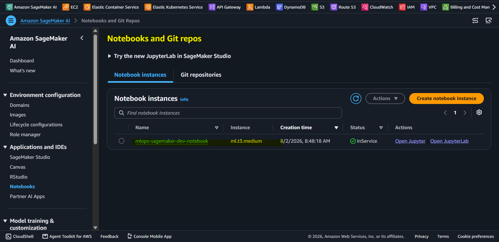
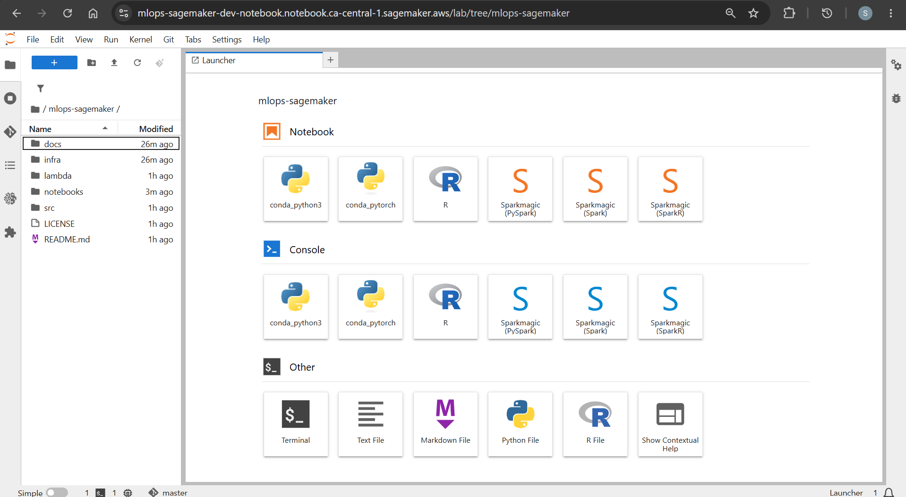
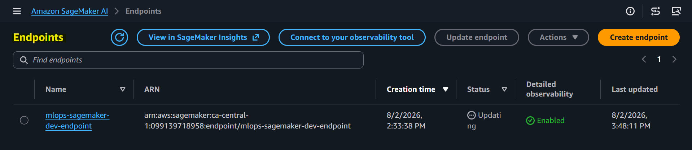

# Amazon SageMaker

A side project that explores key features of sagemaker.

- [Amazon SageMaker](#amazon-sagemaker)
  - [Sagamaker](#sagamaker)
  - [Feature: JupyterLab Notebooks](#feature-jupyterlab-notebooks)
  - [Feature: Training Job](#feature-training-job)
  - [Feature: Deployment Endpoints](#feature-deployment-endpoints)
  - [Integrate with `Lambda` and `API Gateway`](#integrate-with-lambda-and-api-gateway)
  - [Documentation](#documentation)

---

## Sagamaker

- `Amazon SageMaker`
  - a fully managed cloud platform by AWS that helps developers and data scientists build, train, and deploy machine learning models.
  - simplifies workflows by removing the need to manually set up or manage servers.

---

## Feature: JupyterLab Notebooks

- `JupyterLab feature`
  - A managed Jupyter notebook instance within SageMaker.

- JupyterLab UI
  

- Notebook UI
  

- Training with the classic bike sharing dataset
  

  

---

## Feature: Training Job

- Training Job

---

## Feature: Deployment Endpoints

- Deployment Endpoint

---

## Integrate with `Lambda` and `API Gateway`

- Diagram

- Test API Gateway

---

## Documentation

- [Jupyter Notebook](./docs/notebook.md)
- [Training Jobs](./docs/training_job.md)
- [Deployment Endpoints](./docs/endpoint.md)
