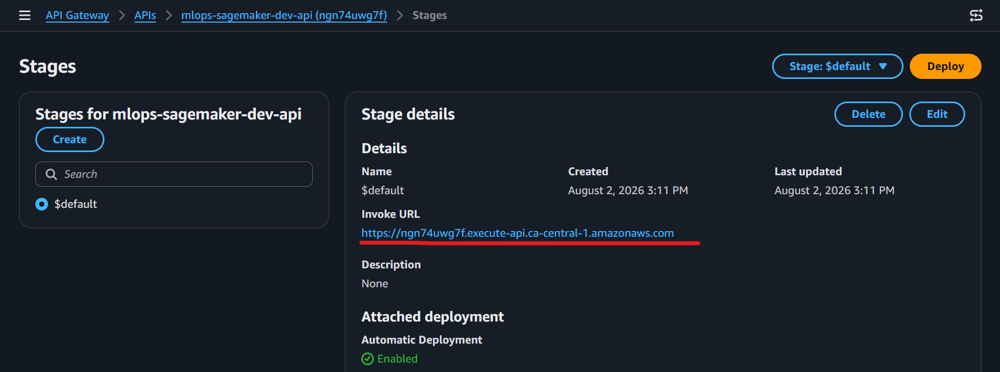
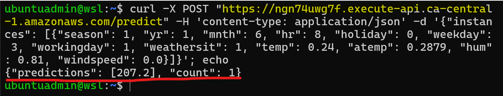

# Amazon SageMaker

A side project that explores key features of sagemaker.

- [Amazon SageMaker](#amazon-sagemaker)
  - [Amazon SageMaker AI](#amazon-sagemaker-ai)
  - [Feature: `JupyterLab Notebooks`](#feature-jupyterlab-notebooks)
  - [Feature: Training Job](#feature-training-job)
  - [Feature: Endpoints](#feature-endpoints)
  - [End-to-end Deployment](#end-to-end-deployment)
  - [Documentation](#documentation)

---

## Amazon SageMaker AI

- `Amazon SageMaker AI`
  - a fully managed cloud service from AWS that lets `developers` and `data scientists` **build, train, and deploy** machine learning and foundation models.
- **Benefits**:
  - **removes the heavy work** of setting up servers, handling data, and scaling hardware by putting the whole machine learning process into one place.

---

## Feature: `JupyterLab Notebooks`

- `JupyterLab feature`
  - A fully managed Amazon SageMaker AI **computing environments** running `JupyterLab` that let `data scientists` explore data and build machine learning models.
- Benefi:
  - **without managing server infrastructure**.

---

- JupyterLab Notebook UI

- Notebook in action: Training with the classic bike sharing dataset

---

## Feature: Training Job

- **Training Job**
  - a fully managed service that provisions cloud hardware, **runs machine learning training code** inside a container, and automatically **saves the trained model** back to storage.

- Benefits:
  - automatically when a job **starts and shut down immediately** when it finishes.
  - use built-in **algorithms** or bring your own custom Docker containers for **popular frameworks** like `PyTorch` and `TensorFlow`.

---

- **Training Jobs in action:**

---

## Feature: Endpoints

- `Sagemaker Endpoints`
  - fully managed `HTTPS URLs` used to **host machine learning models** and **deliver live predictions** to applications.

- Endpoints

---

## End-to-end Deployment

- Integrate with `Lambda` and `API Gateway` to serve machine learning model online.

- **API Gateway Endpoint**

- **Test**

---

## Documentation

- [IaC via Terraform](./docs/01-infra.md)
- [Jupyter Notebook](./docs/02-notebook.md)
- [Training Jobs](./docs/03-training_job.md)
- [Endpoints & Deployment](./docs/04-deploy.md)
