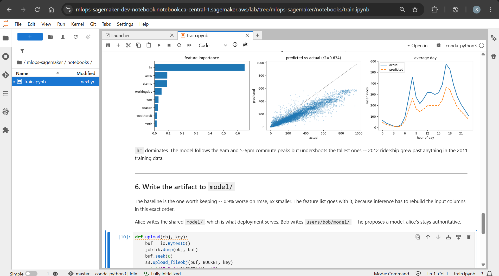
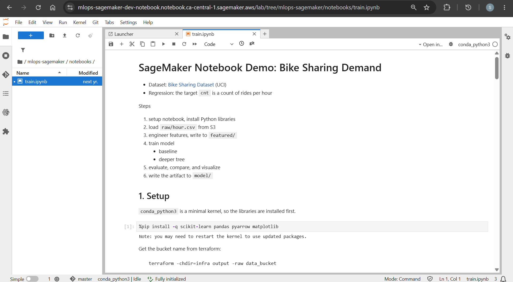

# Amazon SageMaker Studio Demo - Jupyter Notebook

[Back](../README.md)

- [Amazon SageMaker Studio Demo - Jupyter Notebook](#amazon-sagemaker-studio-demo---jupyter-notebook)
  - [Bike sharing demand model](#bike-sharing-demand-model)
    - [Upload to S3](#upload-to-s3)
    - [Taining](#taining)
    - [Model](#model)

---

## Bike sharing demand model

- Dataset:
  - Bike-Sharing Demand Dataset
  - UCI Machine Learning Repository: https://archive.ics.uci.edu/dataset/275/bike+sharing+dataset

- Regression:
  - the target is a count

- Steps

1. upload dataset to S3
2. setup notebook, install Python libraries
3. load `raw/hour.csv` from S3
4. engineer features, write to `featured/`
5. train model, write the artifact to `model/`
   - baseline
   - deeper tree
6. evaluate, compare, and visualize

---

### Upload to S3

```sh
terraform -chdir=infra output -raw data_bucket
# mlops-sagemaker-studio-dev-data-3vi8kw

aws s3 cp data/ "s3://mlops-sagemaker-studio-dev-data-3vi8kw/raw/" --recursive --exclude "*" --include "*.csv"
# upload: data\day.csv to s3://mlops-sagemaker-studio-dev-data-3vi8kw/raw/day.csv
# upload: data\hour.csv to s3://mlops-sagemaker-studio-dev-data-3vi8kw/raw/hour.csv

aws s3 ls "s3://mlops-sagemaker-studio-dev-data-3vi8kw/raw/"
# 2026-08-01 15:23:15          0
# 2026-08-01 15:31:14      57569 day.csv
# 2026-08-01 15:31:14    1156736 hour.csv
```

---

### Taining





---

### Model

```sh
aws s3 ls "s3://mlops-sagemaker-studio-dev-data-3vi8kw/model/"
# 2026-08-01 15:23:15          0
# 2026-08-01 15:57:52        121 features.joblib
# 2026-08-01 15:57:52   12546337 model.joblib
```
