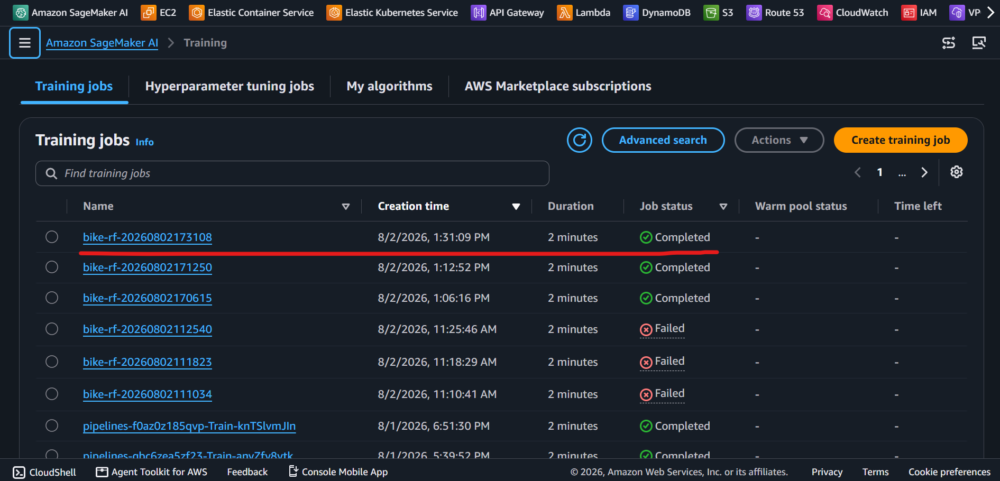

# Amazon SageMaker Demo - Training Job

[Back](../README.md)

- [Amazon SageMaker Demo - Training Job](#amazon-sagemaker-demo---training-job)
  - [Architecture](#architecture)
  - [Key contract](#key-contract)
  - [Use](#use)

---

## Architecture

Training on ephemeral compute. SageMaker provisions the instance, runs the script, uploads the model, and terminates. Nothing bills between jobs.

```
   submit_job.py
        │
        ▼
   ┌─────────────────────────────┐
   │  Training Job (ml.m5.large) │   provisioned on demand,
   │  sklearn container          │   destroyed when done
   │  runs src/train.py          │
   └──┬───────────────────────┬──┘
      │ SM_CHANNEL_TRAIN      │ SM_MODEL_DIR
      ▼                       ▼
  s3://…/raw/bike/      s3://…/models/…/model.tar.gz
```

---

## Key contract

The script never touches S3. SageMaker mounts the channel and collects the
output directory:

```python
p.add_argument("--train",     default=os.environ.get("SM_CHANNEL_TRAIN"))
p.add_argument("--model-dir", default=os.environ.get("SM_MODEL_DIR"))
...
joblib.dump(model, Path(args.model_dir) / "model.joblib")
print(f"rmse={rmse:.4f}")
```

---

## Use

```sh
# init
python -m venv .venv
.venv\Scripts\activate

pip install sagemaker-train

# submit training job
python src/train/submit_job.py --bucket (terraform -chdir=infra output -raw data_bucket) --role   (terraform -chdir=infra output -raw execution_role_arn)

# get most recent trainjob
aws sagemaker list-training-jobs \
    --sort-by CreationTime \
    --sort-order Descending \
    --max-results 1 \
    --query "TrainingJobSummaries[*].[TrainingJobName, CreationTime, TrainingJobStatus]" \
    --output table

# -----------------------------------------------------------
# |                    ListTrainingJobs                     |
# +-------------------------+------------------+------------+
# |  bike-rf-20260802173108 |  1785691869.604  |  Completed |
# +-------------------------+------------------+------------+

# confirm in s3
aws s3 ls "s3://mlops-sagemaker-dev-data-k35ss6/model/bike-rf-20260802173108/output/"
# 2026-08-02 13:33:40     153972 model.tar.gz
```


